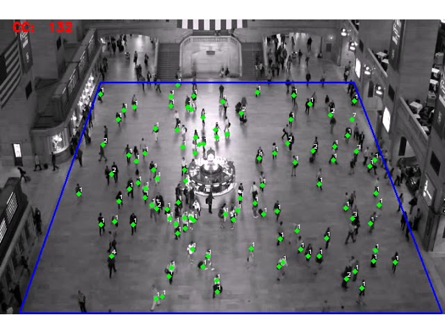

# Project

## What is Insightio?
Insightio is a platform that provides crowd/object counting and tracking solutions for businesses such as schools, concert halls, shops, cafeterias. Users have the capability to establish an account, set up cameras, select zones and define which objects to track. Start using Insightio to count every step and track every move! For a preview, check our [demo](https://youtu.be/QLY67rLorq0?si=5fpSaN8VQ2YNpSAg).

    

## Vision
To lead the way in providing businesses looking for unmatched insights through object and crowd monitoring, boosting productivity, and enabling well-informed decision-making.

## Mission
With the flexible platform Insightio, which provides state-of-the-art solutions for object and crowd tracking, you can empower businesses. Our goal is to continuously innovate in order to provide useful insights, promote growth, and make the world a more intelligent and connected place.

    

## Feautures
* Object Counting and Tracking
* Customizable Zones
* Statistical Visualization
* User-Friendly Interface
* Flexible Camera Configuration
* Security and Error Handling

## Technologies
Integration of Supervision and YOLO models for unparalleled accuracy in object monitoring.
